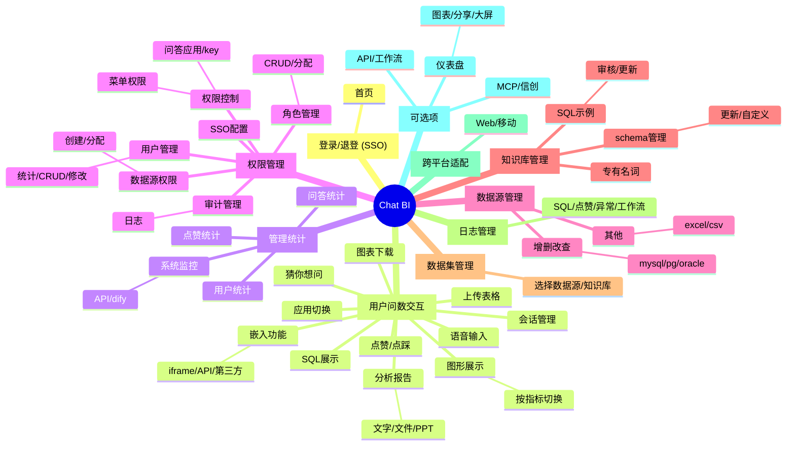

# Chat BI 思维导图

- 登录 / 退登 SSO 账号密码（邮箱）
  - 首页
    - 用户问数界面交互
      - SQL 展示（可选折叠或者展开）
      - 图形展示/切换（折线、柱状、饼图等）
        - 按指标切换数据展示
      - 分析报告
        - 文字
        - 文件
          - word
          - md
          - ......
        - PPT 生成（可选）
          - 对接文多多 AIPPT
      - 会话管理
      - 应用切换
      - 嵌入功能的支持
        - iframe 嵌入
        - API 嵌入
        - 第三方集成（可选）
          - 飞书
          - 钉钉
          - 企业微信
      - 点赞 / 点踩
      - 猜你想问
        - 成功回复后根据回答内容提供下一步推测
        - 问题模糊时提供反问推测
      - 图表下载
      - 语音输入（可选）
      - 上传表格
        - 基于上传的 excel 进行问数
    - 管理统计界面
      - 用户数量统计
      - 点赞点踩统计
      - 系统状态监控
        - API 服务监控
        - dify 工作流监控
      - 问答统计
    - 权限管理（已有需要适配）
      - SSO 对接配置与授权配置
      - 用户管理
        - 用户信息统计
        - 用户增删改查
        - 用户信息修改
      - 角色管理
        - 角色增删改查
        - 角色权限分配
        - 用户角色分配
      - 权限管理 基于角色控制
        - 问答应用权限管理
          - key
            - 增删改查
            - 授权
          - 不同角色可访问的数据源，及表字段
        - 管理后台菜单权限管理
          - 不同角色可以显示不同的配置菜单
      - 审计管理
        - 数据集增删改日志
        - 权限的增删改日志
      - 数据源权限管理
        - 用户创建数据源
          - 创建者归属关系: 每个数据源都与一个创建者用户绑定。
          - 默认管理权限: 创建者自动拥有该数据源的增删改查权限。
        - 数据源分配用户访问
          - 多对多关系: 一个数据源可被多个用户访问；一个用户可访问多个数据源。
          - 授权方式
            - 由拥有管理权限的用户（如创建者或系统管理员）执行
            - 可将权限分配给特定用户或角色。
    - 数据源管理（已有需要适配）
      - 数据源的增删改查
        - mysql
        - pg
        - oracle
        - .....
      - 其他数据源（可选）
        - excel
        - csv
        - .....
    - 知识库管理
      - schame 管理
        - 更新策略
          - 动态
          - 手动
        - 自定义选择 表/字段 新增构建 schema 知识库
      - SQL 问答示例管理
        - 审核 -> 添加 -> 使用
        - 更新策略
          - 用户反馈，作为长期记忆（可选）
          - 直接更新知识库
      - 专有名词库管理
    - 数据集管理
      - 选泽数据源
      - 选择知识库
    - 日志管理（系统层面）
      - SQL 问答日志
      - 点赞/点踩 日志
      - 异常日志
      - 工作流运行日志
    - 跨平台适配
      - Web 端
      - 移动端
        - 移动 Web 端
        - APP（可选）
        - 小程序（可选）
    - 可选项
      - API / 工作流 管理
      - 仪表盘管理
        - 图表增删改查
        - 图表分享
        - 大屏可视化
          - 拖拽式构建大屏
      - MCP 管理
      - 信创适配

## Mind Map

