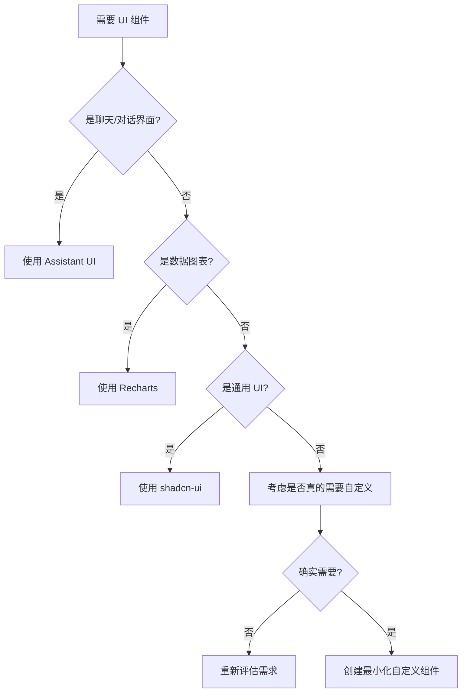

# UI 组件使用规范

> **核心原则**: 遵循 DRY、KISS、YAGNI 原则，避免重复造轮子

## 🎯 组件库选择指南

### 何时使用 shadcn-ui (`@wenshu/ui`)

**适用场景**：

- ✅ 通用 UI 组件（按钮、卡片、表格、表单等）
- ✅ 数据展示组件（表格、分页、对话框等）
- ✅ 管理后台界面
- ✅ 基础交互组件

**组件示例**：

```typescript
import { Button, Card, Table, Dialog, Form } from '@wenshu/ui';

// ✅ 推荐：使用 shadcn-ui 组件
<Card>
  <Table>
    <TableRow>
      <TableCell>用户数据</TableCell>
    </TableRow>
  </Table>
</Card>;
```

**❌ 禁止**：

- 不要自己实现按钮、卡片、表格等基础组件
- 不要为简单的 UI 需求创建自定义组件

---

### 何时使用 Assistant UI (`@assistant-ui/react`)

**适用场景**：

- ✅ AI 聊天界面
- ✅ 对话式 UI
- ✅ 消息流显示
- ✅ 智能助手交互

**组件示例**：

```typescript
import { Thread, AssistantRuntimeProvider } from '@assistant-ui/react';
import { useChatRuntime } from '@assistant-ui/react-ai-sdk';

// ✅ 推荐：使用 Assistant UI 的专业组件
function ChatPage() {
  const runtime = useChatRuntime({ api: '/api/chat' });

  return (
    <AssistantRuntimeProvider runtime={runtime}>
      <Thread />
    </AssistantRuntimeProvider>
  );
}
```

**❌ 禁止**：

- 不要自己实现聊天界面组件
- 不要创建自定义的 `ChatInterface`、`Message`、`Composer` 组件
- 不要手动管理聊天状态

---

### 何时使用 Recharts

**适用场景**：

- ✅ 数据可视化
- ✅ 图表展示（折线图、柱状图、饼图等）
- ✅ 仪表板图表
- ✅ 数据分析界面

**组件示例**：

```typescript
import { LineChart, BarChart, ChartContainer } from '@wenshu/ui';

// ✅ 推荐：使用封装好的图表组件
<ChartContainer height={400}>
  <LineChart data={salesData} />
</ChartContainer>;
```

**❌ 禁止**：

- 不要使用 Canvas 或 SVG 手动绘制图表
- 不要创建自定义的图表组件（除非有特殊需求）

---

## 🚨 开发规范

### 1. 组件选择流程



### 2. 代码审查检查清单

**在 PR 中必须检查**：

- [ ] 是否使用了现有的 UI 库组件？
- [ ] 是否避免了重复造轮子？
- [ ] 聊天界面是否使用了 Assistant UI？
- [ ] 表格、表单是否使用了 shadcn-ui？
- [ ] 图表是否使用了 Recharts？
- [ ] 自定义组件是否有充分的理由？

### 3. 组件创建指南

**只有在以下情况才允许创建自定义组件**：

1. 现有库无法满足特殊业务逻辑
2. 需要深度定制化的样式
3. 性能要求极高的特殊场景
4. 与第三方系统的特殊集成需求

**创建自定义组件时**：

- 必须文档说明为什么不能使用现有库
- 必须保持最小化实现
- 必须考虑可复用性
- 必须包含 TypeScript 类型定义

---

## 📦 依赖管理

### 核心 UI 依赖

```json
{
  "@wenshu/ui": "workspace:*", // shadcn-ui 组件集合
  "@assistant-ui/react": "^0.10.0", // AI 聊天组件
  "@assistant-ui/react-ai-sdk": "^0.10.0", // AI SDK 集成
  "recharts": "^2.12.0", // 图表库
  "lucide-react": "^0.400.0", // 图标库
  "tailwind-merge": "^2.0.0", // 样式合并
  "class-variance-authority": "^0.7.0" // 样式变体
}
```

---

## 🎨 样式规范

### 使用 Tailwind CSS 变量

```css
/* ✅ 推荐：使用 CSS 变量 */
.custom-component {
  background-color: hsl(var(--background));
  color: hsl(var(--foreground));
  border-color: hsl(var(--border));
}

/* ❌ 避免：硬编码颜色 */
.bad-component {
  background-color: #ffffff;
  color: #000000;
}
```

### 组件样式最佳实践

```typescript
import { cn } from '@wenshu/ui';

// ✅ 推荐：使用 cn 函数合并样式
function MyComponent({ className, ...props }) {
  return <div className={cn('base-styles here', className)} {...props} />;
}
```

---

## 🔧 开发工具配置

### ESLint 规则（建议）

```json
{
  "rules": {
    "no-restricted-imports": [
      "error",
      {
        "patterns": [
          {
            "group": ["react", "lucide-react"],
            "message": "请从 @wenshu/ui 导入常用组件"
          }
        ]
      }
    ]
  }
}
```

---

## 📚 学习资源

- [shadcn-ui 组件文档](https://ui.shadcn.com/)
- [Assistant UI 文档](https://assistantui.com/)
- [Recharts 文档](https://recharts.org/)
- [Tailwind CSS 文档](https://tailwindcss.com/)

---

## ⚡ 快速参考

### 常用导入

```typescript
// 通用 UI 组件
import {
  Button,
  Card,
  Table,
  Dialog,
  Form,
  Badge,
  Sheet,
  Tabs,
  Select,
  Input,
  Textarea,
} from '@wenshu/ui';

// 聊天组件
import { Thread, AssistantRuntimeProvider } from '@assistant-ui/react';
import { useChatRuntime } from '@assistant-ui/react-ai-sdk';

// 图表组件
import { LineChart, BarChart, ChartContainer } from '@wenshu/ui';

// 工具函数
import { cn } from '@wenshu/ui';
```

---

**记住**：好的开发者不是能写很多代码的人，而是能避免写不必要代码的人！🚀
