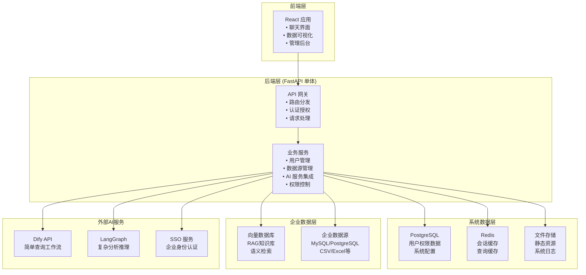
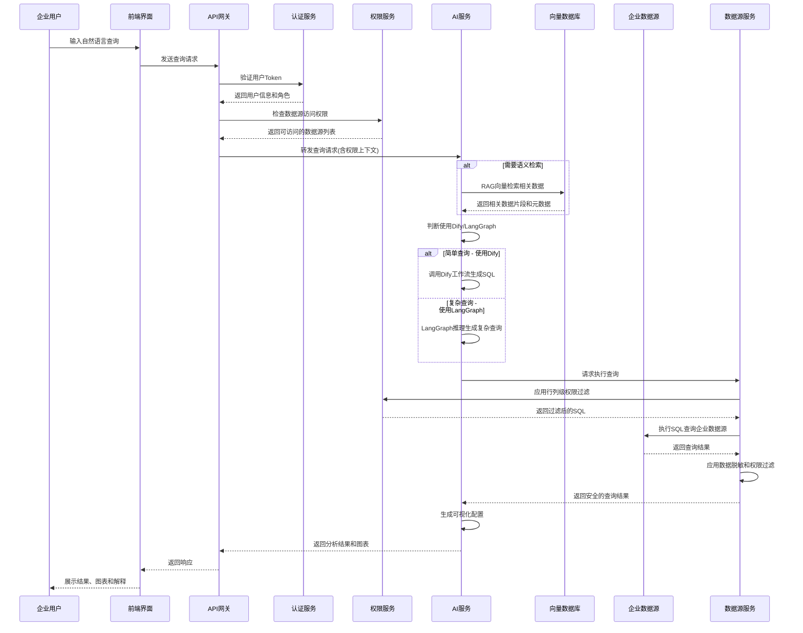
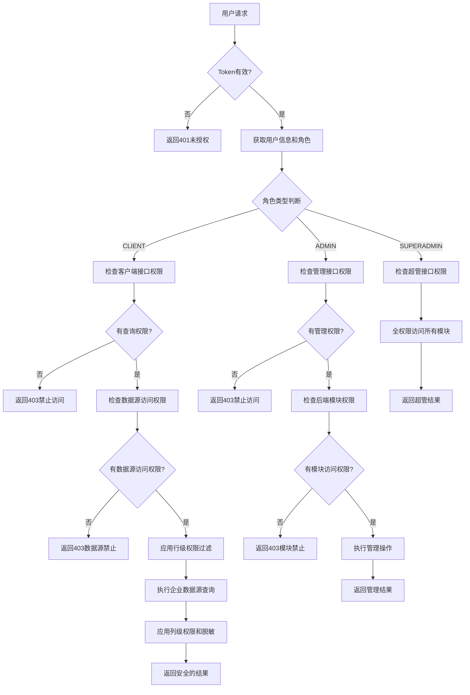
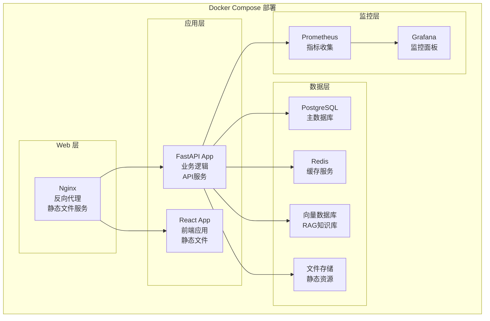

# 智能问数系统架构设计文档 - React + FastAPI + Nx 方案

## 1. 系统概述

### 1.1 系统定位
智能问数是一个企业级私有化部署的对话式数据分析平台。企业可以在内部环境中部署该系统，配置企业内部的各种数据源（数据库、CSV文件等），通过RAG等技术构建企业知识库，为企业员工提供基于自然语言的数据问答能力。

### 1.2 核心功能
- **企业数据源管理**：支持企业配置内部各种数据源（MySQL、PostgreSQL、CSV等）
- **RAG知识库**：将企业数据分片存储到向量数据库，支持语义检索
- **对话式分析**：基于自然语言的数据查询和可视化展示
- **多层级权限控制**：CLIENT/ADMIN/SUPERADMIN三级角色权限体系
- **模块权限管理**：细粒度的后端模块访问权限控制
- **SSO集成**：与企业身份认证系统无缝集成

### 1.3 技术栈选型

#### 后端技术栈
- **框架**：Python 3.12 + FastAPI
- **系统数据库**：PostgreSQL 15+ (用户权限、系统配置)
- **向量数据库**：Chroma/Pinecone (RAG知识库)
- **缓存**：Redis 7.0+ (会话、查询缓存)
- **ORM**：SQLAlchemy 2.0 + Alembic
- **权限**：Casbin (企业RBAC)
- **AI 引擎**：LangGraph + Dify API

#### 前端技术栈
- **框架**：React 18 + TypeScript 5.0+ + Vite 5.0+
- **Monorepo管理**：Nx (支持AI编辑器，快速开发)
- **状态管理**：Zustand / React Query
- **UI 组件**：Tailwind CSS + Headless UI
- **图表库**：Plotly / ECharts

#### 部署技术栈
- **容器化**：Docker + Docker Compose
- **编排**：Kubernetes (可选)
- **监控**：Prometheus + Grafana
- **日志**：ELK Stack

## 2. 系统架构设计

### 2.1 React + FastAPI + Nx Monorepo 架构

#### 架构图


#### 核心特点
- **企业私有化部署**：在企业内部环境中独立部署和运行
- **企业数据源管理**：支持企业配置和管理内部各种数据源
- **RAG知识库**：将企业数据向量化，支持语义检索和智能问答
- **AI引擎协调**：智能路由Dify和LangGraph，处理不同复杂度的查询
- **Nx Monorepo支持**：统一管理前后端代码，支持AI编辑器友好开发

#### 优势
- **开发效率高**：单一代码库，易于开发和调试
- **部署简单**：一个应用，一次部署
- **事务一致性**：单数据库事务，数据一致性有保障
- **运维成本低**：监控和维护相对简单
- **快速迭代**：适合 MVP 和快速原型开发
- **AI辅助开发**：Nx结构化项目组织，便于AI工具理解和生成代码
- **资源利用高效**：无服务间通信开销，资源利用更充分

#### 劣势
- **扩展性有限**：单点瓶颈，难以水平扩展
- **技术栈耦合**：所有功能使用相同技术栈
- **团队协作**：多人开发可能产生代码冲突
- **故障影响面大**：单点故障影响整个系统

#### 适用场景
- **中小型企业**：用户规模在1万以内，追求快速交付的企业
- **敏捷开发团队**：需要快速响应业务需求变化，重视开发效率
- **资源有限场景**：运维团队规模较小，希望降低系统复杂度
- **MVP和原型开发**：需要快速验证业务模式的创业公司
- **技术团队较小**：5-15人的开发团队，希望保持技术栈简单

## 3. 核心数据流设计

### 3.1 用户查询完整流程

> **说明**：以下数据流程基于单体架构设计，各"服务"为FastAPI应用内的不同模块。



### 3.2 权限验证流程



## 4. 部署架构设计

### 4.1 单体式部署架构



#### 部署特点
- **一键部署**：使用 docker-compose 快速启动所有服务
- **环境隔离**：通过容器实现开发、测试、生产环境一致性
- **数据持久化**：数据库和缓存数据通过 Volume 持久化
- **反向代理**：Nginx 处理静态文件和 API 请求转发
- **Nx构建集成**：支持Nx统一构建流程

### 4.2 Kubernetes 部署 (可选)

当系统需要高可用和水平扩展时，可以部署到 Kubernetes：

- **应用部署**：使用 Deployment 部署前后端应用
- **服务发现**：通过 Service 和 Ingress 暴露服务
- **配置管理**：使用 ConfigMap 和 Secret 管理配置
- **存储**：使用 PVC 持久化数据库和文件存储
- **监控告警**：集成 Prometheus 和 Grafana 监控

## 5. 技术实现要点

### 5.1 AI 引擎协调策略

#### 路由决策机制
- **Dify 工作流**：处理标准化查询，如统计数量、列表展示、基础筛选
- **LangGraph 智能体**：处理复杂分析，如趋势分析、对比分析、关联查询
- **降级机制**：Dify 失败时自动降级到 LangGraph 处理

#### 查询分类标准
- 简单查询：单表查询、基础统计、数据列表
- 复杂查询：多表关联、时间序列分析、预测计算

### 5.2 权限控制实现

#### 角色权限体系
- **CLIENT**：普通用户，只能访问数据查询和可视化功能
  - 可访问聊天界面和数据分析功能
  - 根据分配的数据源权限查询企业数据
  - 支持行列级权限控制和数据脱敏
- **ADMIN**：管理员，可访问部分后端管理模块
  - 拥有CLIENT的所有权限
  - 可管理用户和角色（不包括SUPERADMIN用户）
  - 可配置部分数据源和权限设置
  - 访问权限可细分到具体的后端模块
- **SUPERADMIN**：超级管理员，拥有系统全部权限
  - 拥有所有功能的完全访问权限
  - 可管理所有用户、角色和权限
  - 可配置所有数据源和系统设置
  - 可访问所有后端管理模块

#### 模块权限控制
- **数据源管理模块**：ADMIN可管理分配给他的数据源，SUPERADMIN可管理所有
- **用户管理模块**：ADMIN可管理普通用户，SUPERADMIN可管理所有用户
- **系统配置模块**：仅SUPERADMIN可访问
- **权限管理模块**：ADMIN可管理部分权限，SUPERADMIN可管理所有权限

#### 权限矩阵表

| 功能模块 | CLIENT | ADMIN | SUPERADMIN |
|---------|--------|-------|------------|
| **前端功能** | | | |
| 聊天查询界面 | ✓ | ✓ | ✓ |
| 数据可视化 | ✓ | ✓ | ✓ |
| 个人设置 | ✓ | ✓ | ✓ |
| **后端管理模块** | | | |
| 用户管理 | ✗ | 部分 | ✓ |
| 角色权限管理 | ✗ | 部分 | ✓ |
| 数据源管理 | ✗ | 部分 | ✓ |
| 系统配置 | ✗ | ✗ | ✓ |
| 审计日志 | ✗ | 部分 | ✓ |
| **数据权限** | | | |
| 数据源访问 | 按分配 | 按分配 | 全部 |
| 行级权限 | 应用 | 应用 | 可选 |
| 列级权限 | 应用 | 应用 | 可选 |
| 数据脱敏 | 应用 | 应用 | 可选 |

#### 数据权限控制
- 根据用户角色和分配的数据源权限进行访问控制
- 支持行级权限过滤，确保用户只能查看授权数据
- 支持列级权限控制和敏感数据脱敏处理

## 6. Nx Monorepo 开发实践

### 6.1 项目结构

```
workspace/
├── apps/
│   ├── web-app/              # React前端应用
│   ├── admin-app/            # React管理后台
│   └── api/                  # FastAPI后端
├── libs/
│   ├── shared-types/         # 共享TypeScript类型
│   ├── ui-components/        # 共享UI组件
│   ├── utils/                # 共享工具函数
│   └── api-client/           # API客户端库
├── tools/
│   └── scripts/              # 构建和部署脚本
└── nx.json                   # Nx配置文件
```

### 6.2 开发优势

#### AI工具集成
- **结构化代码组织**：清晰的目录结构便于AI工具理解项目架构
- **类型安全共享**：前后端共享类型定义，AI可以更准确地生成代码
- **Nx MCP支持**：支持Cursor等AI编辑器的智能代码生成
- **统一代码风格**：ESLint和Prettier配置统一，便于AI工具生成符合规范的代码

#### 开发效率提升
- **增量构建**：只构建发生变化的部分，大幅提升构建速度
- **智能缓存**：Nx智能缓存机制，避免重复构建
- **代码共享**：前后端可以共享类型、工具函数和组件
- **统一工具链**：一套工具链管理整个项目

## 7. 总结与建议

### 7.1 架构优势总结

**React + FastAPI + Nx 单体架构**的核心价值：
- **简单可靠**：单体架构避免分布式系统复杂性，易于理解和维护
- **快速交付**：开发效率高，适合快速迭代和MVP验证
- **成本可控**：运维成本低，资源利用率高，适合中小型企业
- **AI友好开发**：Nx结构化管理，支持现代AI编辑器智能代码生成
- **技术栈成熟**：React + FastAPI技术栈成熟稳定，人才储备充足

### 7.2 实施建议

#### 技术实施路径
1. **环境搭建**：建立Nx Monorepo开发环境，配置开发工具链
2. **类型定义**：建立前后端共享的TypeScript类型库
3. **核心功能**：优先实现用户认证、权限控制和数据源管理
4. **AI集成**：集成Dify和LangGraph，实现智能查询功能
5. **部署优化**：配置Docker容器化部署和CI/CD流程

#### 团队能力要求
- 熟悉React和FastAPI开发
- 掌握Nx Monorepo工具的使用
- 了解企业级权限控制和安全最佳实践
- 具备Docker部署和运维经验

#### 预期收益
- 开发效率提升40-60%（统一工具链和代码共享）
- 部署运维成本降低50%（单体应用简化运维）
- 故障排查时间减少70%（单一应用，问题定位容易）
- AI辅助开发效率提升30%（结构化项目组织）

### 7.3 技术风险与应对

#### 主要风险
- **扩展性瓶颈**：单体架构在高并发场景下扩展性有限
- **技术债务**：长期发展可能积累技术债务
- **团队协作**：多人开发可能产生代码冲突

#### 应对策略
- **模块化设计**：在单体内部保持良好的模块化设计
- **性能监控**：建立完善的性能监控，及时发现瓶颈
- **代码质量**：严格的代码审查和自动化测试
- **架构演进**：预留架构演进接口，必要时可拆分为微服务

### 7.4 适用企业类型

**强烈推荐使用此方案的企业：**
- 用户规模在1万以内的中小型企业
- 5-15人的技术团队
- 追求快速交付和低运维成本
- 希望使用AI辅助开发提升效率
- 对系统高可用要求不是极其严格

**此方案可以满足大部分企业的智能问数需求，是企业级私有化部署的理想选择。**
